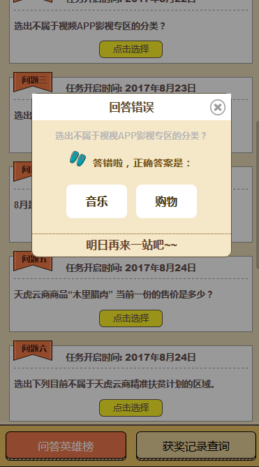
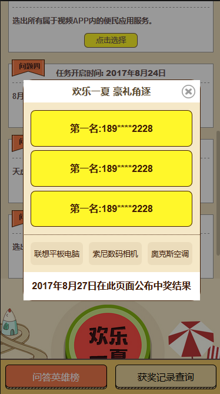
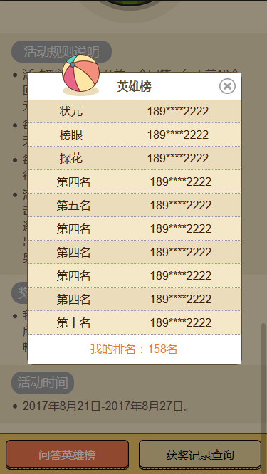
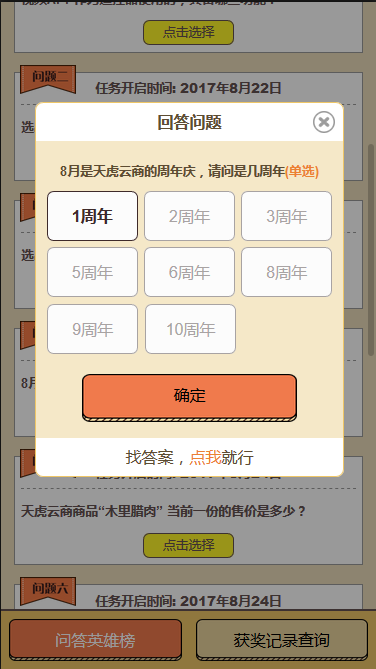

# 电信活动移动端页面

#### 相关介绍 

> * 项目不大，没有引入框架，采用的技术栈是html+css+jQuery。独立完成。
> * 主页只有一个，但衍生出来内容格式不同的模态框20个左右。
> * 在考虑动态操作dom影响性能但一次性加载太多dom也不太合理的情况下，最终在不同的场景采用动态添加删除dom与隐藏显示dom [display:none|block]相结合。
> * 页面宽高依据相对大小[x%]来设置，几乎没有出现px[border采用px]单位。
> * 没有采用float来浮动布局
> * 与后台的交互都是ajax
> * 有些动态加载进去的dom需要绑定事件时利用了事件捕捉来绑定事件。  

#### 总结
> * [尽管定义好借口文档了]接口不停的改，需求不停的改，学会了沟通与理解！
##### 部分页面截图

____

_____   

#### 补充
有些数据不是上线的准确数据，因为这个具体要后台给。这是在开发时候自己模拟后台返回数据截的图。  
边框的的拐角都已经处理加上圆角。但是部分白色背景的border-radius并没有什么用，望大神告知原因！  
如第二行第一张 以及 第三行第二张 ，实在是感谢，不知道自己卡在哪里了。代码都差不多，白色的背景 宽度都是相对的 谢谢大神告知！
